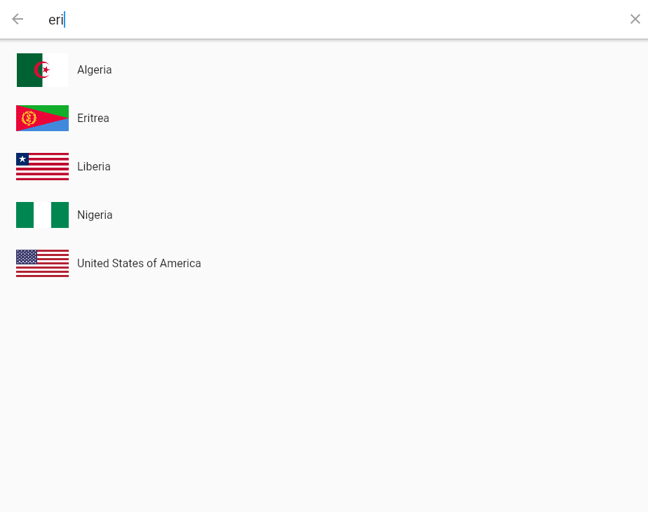

You can contact me here: waliul.sami.ahmed@gmail.com
# NewsByCountry
Created by Sami-ul

Oftentimes smaller countries are excluded from the media as other events supercede them in impact. As a result people end up not knowing much about these smaller countries who are going through big changes and issues on their own. To combat this, I created this news application which encourages users to search through many countries to read the news about. This allows users to stay informed. It also attempts to create a summary by scraping the text from these news sites. I aim to publish this site in the future.

## Info
- This application allows users to search for news by each country
- Users can also recieve a summary of each article pulled
- Due to the large variety of website designs for news services, it is hard to pull a summary for every single one
- If errors occur in pulling news for a country, try going back and searching for that same country again
- Clicking on a list object leads you to the webpage where the article is

## Setup
- Make sure you have the following tools installed
    - Python
    - NodeJS
    - Flutter
- In your command prompt, navigate to the same folder that this readme is located in and type `./setup_packages` and press enter
    - This bat file will run all the necessary packaging operations for this app, it may take up to 2 minutes
    - You only need to do this once
- After that is done, run the command `./run_app.bat`
    - This will run all the components of the server which will be served on localhost
    - Then it will automatically run flutter in a chrome
    - Once you are done with this simply close the command prompt so the servers can close
    
## Work In Progress
- Enhancing the summary function
    - Currently it incorporates incomplete quotations and picks weird portions that it deems as important
    - It is also extractive, future plans include making the summary abstractive
